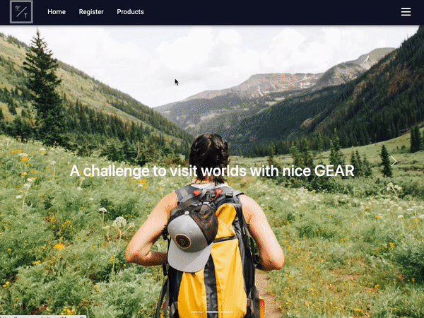
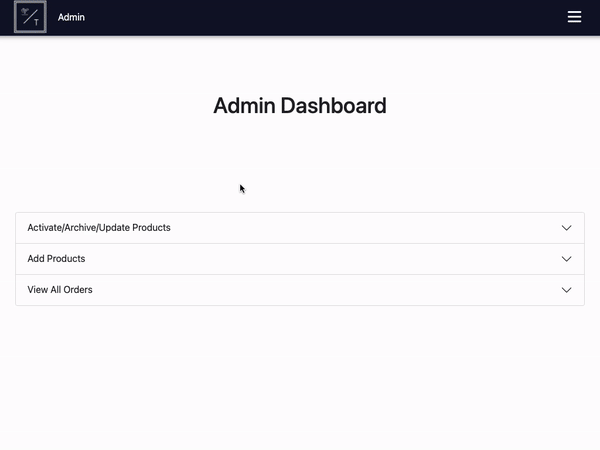

<h1 align="center">
Portfolio - EC website [Server Side]
</h1>
<h3 align="center">
💵Enjoy internet shopping🤩
</h3>

<p align="right"> 
</img>
</img>

</p>

<br>

## Note

&emsp;Client and Server sides of code are separated.  
&emsp;Please visit Client side Github page below as well.  
&emsp;[Server side - https://github.com/Masahiro-Kaga/portfolio-ECwebsite-clientside](https://github.com/Masahiro-Kaga/portfolio-ECwebsite-clientside)

<br>

---
<h3 color="Yellow" align="center">All the same description on client/server below </h3>

---

<br>

## URL

&emsp;[EC website - https://masaecwebsite.netlify.app](https://masaecwebsite.netlify.app)

<br>

## Features

- MERN stack.
- Fetch API.
- React Bootstrap and Emotions are used for styling.
- Material UI for Navbar as well.
- Use Mongodb as database.
- Set Registration and authentication system for admin and login user with web token.
- Three different menu between visitor/login user/admin.
- Validation works.
- Fully responsive.

<br>

## Demo

<br>

1. Register to start ordering(Mongodb is active, so you can register.)
<div style="text-align:center ; display:flex ; flex-direction:row" >
    
</div>
<br>

2. Login with email and password and order.
<div style="text-align:center ; display:flex ; flex-direction:row" >
    
</div>
<br>

3. Login as admin and show dashbord. Note that email address is "1@1" , password is "1".
<div style="text-align:center ; display:flex ; flex-direction:row" >
    
</div>
<br>

1. Toggle status(archive/active) and update product info.
<div style="text-align:center ; display:flex ; flex-direction:row" >
    
</div>
<br>

5. Add new product and check ordered list.
<div style="text-align:center ; display:flex ; flex-direction:row" >
    
</div>
<br>


## Proud of
- A number of API routers.
- Authentication system.

<br>

## Want to add
- Add function of stock product picture on cloud.

<br>

## Usage

&emsp; On the terminal under "client" folder, hit the command below to launch web page on your local environment.

```
npm start
``` 
&emsp; On the terminal under "server" folder, hit the command below to run web server on your local environment.

```
npm run dev
``` 
<br>

## Deploy

- Netlify(For client side)
- Heroku(For server side)